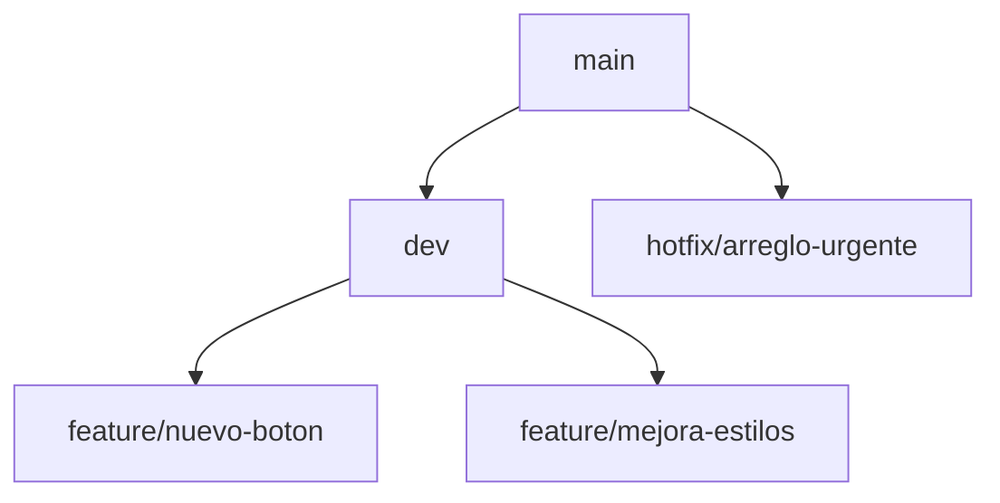

# Flujo DevOps con Git

## Estructura de ramas
- `main`: Rama de producción
- `dev`: Rama de desarrollo
- `hotfix/*`: Correcciones urgentes
- `feature/*`: Nuevas funcionalidades

## Diagrama de flujo

